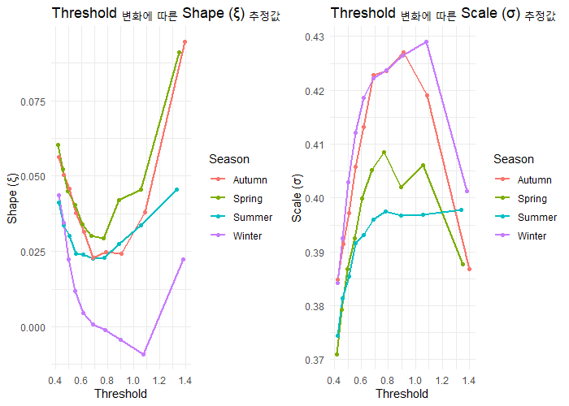

```{r setup, include=FALSE}
knitr::opts_chunk$set(echo = FALSE, message = FALSE, warning = FALSE)
```


```{r ,echo = FALSE}
library(dplyr)
library(zoo)  # 이동평균 계산
library(ggplot2)
library(reshape2)
library(lubridate)
library(tidyr)
library(moments)  # 첨도 계산을 위한 패키지
library(forecast)  # ACF 분석
library(TSA)       # 주파수 분석(FFT)
library(signal)  # 신호 필터링
library(gridExtra)  # 여러 개의 ggplot을 한 화면에 표시
library(grid)
load("data//run1.RData")
load("data//run2.RData")
load("data//run3.RData")
load("data//run4.RData")
```


# 시계열성 

<!-- 이전 시간 lag 1때와 시계열성이 강하다 라고 알려짐 그부분에 대해서 살펴봄  -->
<!-- ##  지역별 lag=1 산점도 -->
<!-- ```{r} -->
<!-- ################# X_t , X_{t-1} plot ############## -->
<!-- # 빈 리스트 생성 (각 위치별 ggplot 저장) -->
<!-- plot_list <- list() -->
<!-- # 5x5 격자에서 각각의 위치에 대해 그래프 생성 -->
<!-- for (i in 1:5) { -->
<!--   for (j in 1:5) { -->
<!--     # (i,j) 위치의 강수량 데이터 -->
<!--     X_t <- run1[i,j,]   -->
<!--     T <- length(X_t) -->

<!--     # X_{t-1}과 X_t 데이터 생성 -->
<!--     X_t_minus1 <- X_t[1:(T-1)] -->
<!--     X_t_current <- X_t[2:T] -->

<!--     # 데이터 프레임 생성 -->
<!--     df <- data.frame(X_t_minus1 = X_t_minus1, X_t_current = X_t_current) -->

<!--     # 밀도를 색으로 표현한 산점도 (범례 및 타이틀 제거) -->
<!--     p <- ggplot(df, aes(x = X_t_minus1, y = X_t_current)) + -->
<!--       geom_bin2d(bins = 50) +   -->
<!--       scale_fill_gradient(low = "blue", high = "red", guide = "none") +  # 범례 제거 -->
<!--       labs(x = NULL, y = NULL) +  # 축 라벨 제거 -->
<!--       theme_minimal() + -->
<!--       theme(legend.position = "none",  # 범례 제거 -->
<!--             plot.title = element_blank(),  # 타이틀 제거 -->
<!--             axis.text = element_blank(),  # 축 눈금 제거 -->
<!--             axis.ticks = element_blank())  # 축 눈금 제거 -->

<!--     # 리스트에 저장 -->
<!--     plot_list[[length(plot_list) + 1]] <- p -->
<!--   } -->
<!-- } -->

<!-- x_label <- textGrob(expression(X[t-1]), gp = gpar(fontsize = 14, fontface = "bold")) -->
<!-- y_label <- textGrob(expression(X[t]), rot = 90, gp = gpar(fontsize = 14, fontface = "bold")) -->
<!-- title_label = textGrob("run4", gp = gpar(fontsize = 14, fontface = "bold")) -->

<!-- # 5x5 격자로 플롯 정렬 -->
<!-- grid.arrange( -->
<!--   arrangeGrob(grobs = plot_list, ncol = 5, nrow = 5), -->
<!--   bottom = x_label,  # X축 제목 -->
<!--   left = y_label,     # Y축 제목 -->
<!--   top = title_label -->
<!-- ) -->

<!-- ``` -->

<!-- 연관성이 1/x꼴의 모양... 극단값이 $X_{t-1}$의 크기에 비례하지 않는것같다  -->

<!-- run1~run4별로 지역적 차이가 있는것같음 , 지역성의 covariate를 다른게 아닐까? -->


<!-- ##  auto lag=1 -->
<!-- ```{r} -->
<!-- ################# X_{t-1} 의 크기에 따른 계수 ############# -->
<!-- # 특정 위치 (1,1)에서 시계열 데이터 추출 -->
<!-- data_series <- run1[1,1,] -->

<!-- # X_{t-1}과 X_t 정의 (로그 변환 없이) -->
<!-- X_t1 <- data_series[1:(length(data_series)-1)] -->
<!-- X_t <- data_series[2:length(data_series)] -->

<!-- # 데이터프레임 생성 -->
<!-- df <- data.frame(X_t1, X_t) -->

<!-- # X_{t-1}을 분위수(quantile) 기준으로 10개 그룹으로 나눔 -->
<!-- df <- df %>% -->
<!--   mutate(X_bin = ntile(X_t1, 10))  # 10분위로 구분 -->

<!-- # 각 구간별로 AR(1) 모델 적합 및 계수, p-value 계산 -->
<!-- ar_results <- df %>% -->
<!--   group_by(X_bin) %>% -->
<!--   summarise(beta1 = coef(lm(X_t ~ X_t1, data = cur_data()))[2], -->
<!--             p_value = summary(lm(X_t ~ X_t1, data = cur_data()))$coefficients[2,4]) -->

<!-- # 결과 출력 -->
<!-- print(ar_results) -->

<!-- # 계수 시각화 -->
<!-- ggplot(ar_results, aes(x=factor(X_bin), y=beta1)) + -->
<!--   geom_bar(stat="identity", fill="steelblue") + -->
<!--   theme_minimal() + -->
<!--   labs(title="X_{t-1} 크기에 따른 AR(1) 계수 변화 (원 자료)",  -->
<!--        x="X_{t-1} 구간", y="AR(1) 계수") + -->
<!--   theme(axis.text.x = element_text(angle = 45, hjust = 1)) -->
<!-- ``` -->

<!-- $X_{t-1}$의 크기에 따라 유의성 및 계수가 다름  -->

<!-- 크기가 작을때 엄청나게 큰 계수를 가지고 있음 (극단값에 의한 영향,이전시점 강수량이 적어도 큰값이 나온다.) -->

<!-- ## 이전 강수량 값 크기에 따른 산점도  -->

<!-- $X_{t-1}$ 의 크기에 따른 $X_t$ 값 산점도 -->

<!-- ```{r,echo = TRUE } -->

<!-- ################# X_{t-1} 의 크기에 따른 X_t 값 산점도  ############# -->
<!-- # 특정 위치 (1,1)에서 시계열 데이터 추출 -->
<!-- data_series <- run3[1,1,] -->

<!-- # X_{t-1}과 X_t 생성 -->
<!-- X_t1 <- data_series[1:(length(data_series)-1)] -->
<!-- X_t <- data_series[2:length(data_series)] -->

<!-- # 데이터프레임 생성 -->
<!-- df <- data.frame(X_t1, X_t) -->

<!-- # X_{t-1}을 분위수(quantile) 기준으로 10개 그룹으로 나눔 -->
<!-- df <- df %>% -->
<!--   mutate(X_bin = ntile(X_t1, 10))  # 10분위(Decile)로 구분 -->

<!-- # facet_wrap을 활용한 그룹별 산점도 -->
<!-- ggplot(df, aes(x = X_t1, y = X_t)) + -->
<!--   geom_point(alpha = 0.6, color = "blue") +  # 반투명한 파란색 점 -->
<!--   theme_minimal() + -->
<!--   labs(title = "구간별 X_{t-1} vs. X_t 산점도 (Facet Free)", -->
<!--        x = "X_{t-1} (이전 시점 값)", -->
<!--        y = "X_t (현재 시점 값)") + -->
<!--   facet_wrap(~X_bin, scales = "free")  # 그룹별로 분리 및 자유 스케일 적용 -->
<!-- ``` -->

<!-- 중간 구간에서는 어느정도 일정한 수준성이 유지된다. 초반과 후반과는 특성이 다르다.  -->


<!-- # 결론  -->

<!-- - 통계적으로 auto lag=1 시계열성이 존재하지만 / 존재하지 않는것 같다  -->

<!-- - 이전 강수량의 중반부와 초반,후반값에 따른 trend 차이가 존재  -->

<!-- - run1~run4는 지역성차이가 존재  -->


# 

run1에서 365일 trend , 이걸보고 계절성을 나눌수도 있을 것 같다. 
90% percentile은 겨울, 봄이 높은데 , 75%은 오히려 낮다 

```{r}
# 데이터 정보 설정
days_per_year <- 365
years <- 165  # 1850년~2014년 (총 165년)
grid_size <- 5  # 5x5 지역

# 분위수 데이터를 저장할 리스트
percentile_list <- list()

# 5x5 지역에 대해 반복문 수행
for (i in 1:grid_size) {
  for (j in 1:grid_size) {
    # 각 위치의 강수량 데이터 가져오기
    rainfall_data <- run1[i, j, ]
    
    # 날짜 벡터 생성
    day_of_year <- rep(1:days_per_year, years)
    
    # 데이터 프레임 생성
    df <- data.frame(Cell = paste0("(", i, ",", j, ")"), 
                     Day = day_of_year, 
                     Rainfall = rainfall_data)
    
    # 분위수(10%, 25%, 50%, 75%, 90%) 계산
    percentiles <- df %>%
      group_by(Day) %>%
      summarise(p10 = quantile(Rainfall, 0.10, na.rm=TRUE),
                p25 = quantile(Rainfall, 0.25, na.rm=TRUE),
                p50 = quantile(Rainfall, 0.50, na.rm=TRUE),
                p75 = quantile(Rainfall, 0.75, na.rm=TRUE),
                p90 = quantile(Rainfall, 0.90, na.rm=TRUE)) %>%
      mutate(Cell = paste0("(", i, ",", j, ")"))  # 셀 위치 추가
    
    # 리스트에 저장
    percentile_list[[paste0(i, "_", j)]] <- percentiles
  }
}

# 모든 데이터를 하나의 데이터 프레임으로 결합
percentile_df <- bind_rows(percentile_list)

# X축 눈금 (월별 대표 일자)
month_ticks <- c(1, 32, 60, 91, 121, 152, 182, 213, 244, 274, 305, 335)
month_labels <- c("Jan", "Feb", "Mar", "Apr", "May", "Jun", 
                  "Jul", "Aug", "Sep", "Oct", "Nov", "Dec")

# 5x5 지역에 대해 분위수 그래프 생성 (facet_wrap 사용)
ggplot(percentile_df, aes(x=Day)) +
  geom_line(aes(y=p10, color="10%"), linewidth=0.6) +
  geom_line(aes(y=p25, color="25%"), linewidth=0.6) +
  geom_line(aes(y=p50, color="50% (Median)"), linewidth=0.8) +
  geom_line(aes(y=p75, color="75%"), linewidth=0.6) +
  geom_line(aes(y=p90, color="90%"), linewidth=0.6) +
  labs(title="Precipitation Percentiles by Day (1850-2014) for 5x5 Grid",
       x="Day of the Year", y="Precipitation (mm)", color="Percentile") +
  theme_minimal() +
  scale_x_continuous(breaks=month_ticks, labels=month_labels) +
  theme(axis.text.x = element_blank()) +
  facet_wrap(~Cell, ncol=5)
```


## Cell별 

```{r}

#########################

# 하위 X% 설정
lower_percentile <- 10 # 예: 하위 10% 선택

# 하위 X% 평균 강수량 계산 함수
calculate_lower_percentile_mean <- function(run_data, label, percentile) {
  lower_mean_precip <- matrix(NA, nrow = 5, ncol = 5)
  
  for (i in 1:5) {
    for (j in 1:5) {
      # 특정 셀의 강수량 데이터 추출
      values <- run_data[i, j, ]
      
      # 하위 X% 값 선택
      threshold <- quantile(values, probs = percentile / 100, na.rm = TRUE)
      lower_values <- values[values <= threshold]
      
      # 하위 X% 평균 계산
      lower_mean_precip[i, j] <- mean(lower_values, na.rm = TRUE)
    }
  }
  
  # 데이터 프레임 변환
  df <- melt(lower_mean_precip)
  colnames(df) <- c("X", "Y", "MeanPrecip")
  df$Run <- label
  return(df)
}

# 각 Run 데이터 변환 (하위 X% 평균 강수량)
df1 <- calculate_lower_percentile_mean(run1, "Run1", lower_percentile)
df2 <- calculate_lower_percentile_mean(run2, "Run2", lower_percentile)
df3 <- calculate_lower_percentile_mean(run3, "Run3", lower_percentile)
df4 <- calculate_lower_percentile_mean(run4, "Run4", lower_percentile)

# 전체 데이터에서 최소, 최대값 구하기 (컬러 스케일 통일)
all_data <- rbind(df1, df2, df3, df4)
min_val <- min(all_data$MeanPrecip, na.rm = TRUE)
max_val <- max(all_data$MeanPrecip, na.rm = TRUE)

# 공통 스타일을 적용한 히트맵 생성 함수 (동일한 컬러 스케일 범위 설정)
create_heatmap <- function(df, title) {
  ggplot(df, aes(x = X, y = Y, fill = MeanPrecip)) +
    geom_tile() +
    scale_fill_gradient(low = "grey", high = "red", limits = c(min_val, max_val)) +  # 동일한 범위 설정
    labs(title = title, x = "X-axis (Grid)", y = "Y-axis (Grid)", fill = "Mean Precip") +
    theme_minimal()
}

# 4개 히트맵 생성 (컬러 스케일 동일)
plot1 <- create_heatmap(df1, paste0("Run1 - Lower ", lower_percentile, "% Mean Precip"))
plot2 <- create_heatmap(df2, paste0("Run2 - Lower ", lower_percentile, "% Mean Precip"))
plot3 <- create_heatmap(df3, paste0("Run3 - Lower ", lower_percentile, "% Mean Precip"))
plot4 <- create_heatmap(df4, paste0("Run4 - Lower ", lower_percentile, "% Mean Precip"))

# 4개 그래프를 한 화면에 배치
grid.arrange(plot1, plot2, plot3, plot4, ncol = 2)


# 하위 X% 설정
lower_percentile <- 50 # 예: 하위 10% 선택

# 하위 X% 평균 강수량 계산 함수
calculate_lower_percentile_mean <- function(run_data, label, percentile) {
  lower_mean_precip <- matrix(NA, nrow = 5, ncol = 5)
  
  for (i in 1:5) {
    for (j in 1:5) {
      # 특정 셀의 강수량 데이터 추출
      values <- run_data[i, j, ]
      
      # 하위 X% 값 선택
      threshold <- quantile(values, probs = percentile / 100, na.rm = TRUE)
      lower_values <- values[values <= threshold]
      
      # 하위 X% 평균 계산
      lower_mean_precip[i, j] <- mean(lower_values, na.rm = TRUE)
    }
  }
  
  # 데이터 프레임 변환
  df <- melt(lower_mean_precip)
  colnames(df) <- c("X", "Y", "MeanPrecip")
  df$Run <- label
  return(df)
}

# 각 Run 데이터 변환 (하위 X% 평균 강수량)
df1 <- calculate_lower_percentile_mean(run1, "Run1", lower_percentile)
df2 <- calculate_lower_percentile_mean(run2, "Run2", lower_percentile)
df3 <- calculate_lower_percentile_mean(run3, "Run3", lower_percentile)
df4 <- calculate_lower_percentile_mean(run4, "Run4", lower_percentile)

# 전체 데이터에서 최소, 최대값 구하기 (컬러 스케일 통일)
all_data <- rbind(df1, df2, df3, df4)
min_val <- min(all_data$MeanPrecip, na.rm = TRUE)
max_val <- max(all_data$MeanPrecip, na.rm = TRUE)

# 공통 스타일을 적용한 히트맵 생성 함수 (동일한 컬러 스케일 범위 설정)
create_heatmap <- function(df, title) {
  ggplot(df, aes(x = X, y = Y, fill = MeanPrecip)) +
    geom_tile() +
    scale_fill_gradient(low = "grey", high = "red", limits = c(min_val, max_val)) +  # 동일한 범위 설정
    labs(title = title, x = "X-axis (Grid)", y = "Y-axis (Grid)", fill = "Mean Precip") +
    theme_minimal()
}

# 4개 히트맵 생성 (컬러 스케일 동일)
plot1 <- create_heatmap(df1, paste0("Run1 - Lower ", lower_percentile, "% Mean Precip"))
plot2 <- create_heatmap(df2, paste0("Run2 - Lower ", lower_percentile, "% Mean Precip"))
plot3 <- create_heatmap(df3, paste0("Run3 - Lower ", lower_percentile, "% Mean Precip"))
plot4 <- create_heatmap(df4, paste0("Run4 - Lower ", lower_percentile, "% Mean Precip"))

# 4개 그래프를 한 화면에 배치
grid.arrange(plot1, plot2, plot3, plot4, ncol = 2)


# 하위 X% 설정
lower_percentile <- 90 # 예: 하위 10% 선택

# 하위 X% 평균 강수량 계산 함수
calculate_lower_percentile_mean <- function(run_data, label, percentile) {
  lower_mean_precip <- matrix(NA, nrow = 5, ncol = 5)
  
  for (i in 1:5) {
    for (j in 1:5) {
      # 특정 셀의 강수량 데이터 추출
      values <- run_data[i, j, ]
      
      # 하위 X% 값 선택
      threshold <- quantile(values, probs = percentile / 100, na.rm = TRUE)
      lower_values <- values[values <= threshold]
      
      # 하위 X% 평균 계산
      lower_mean_precip[i, j] <- mean(lower_values, na.rm = TRUE)
    }
  }
  
  # 데이터 프레임 변환
  df <- melt(lower_mean_precip)
  colnames(df) <- c("X", "Y", "MeanPrecip")
  df$Run <- label
  return(df)
}

# 각 Run 데이터 변환 (하위 X% 평균 강수량)
df1 <- calculate_lower_percentile_mean(run1, "Run1", lower_percentile)
df2 <- calculate_lower_percentile_mean(run2, "Run2", lower_percentile)
df3 <- calculate_lower_percentile_mean(run3, "Run3", lower_percentile)
df4 <- calculate_lower_percentile_mean(run4, "Run4", lower_percentile)

# 전체 데이터에서 최소, 최대값 구하기 (컬러 스케일 통일)
all_data <- rbind(df1, df2, df3, df4)
min_val <- min(all_data$MeanPrecip, na.rm = TRUE)
max_val <- max(all_data$MeanPrecip, na.rm = TRUE)

# 공통 스타일을 적용한 히트맵 생성 함수 (동일한 컬러 스케일 범위 설정)
create_heatmap <- function(df, title) {
  ggplot(df, aes(x = X, y = Y, fill = MeanPrecip)) +
    geom_tile() +
    scale_fill_gradient(low = "grey", high = "red", limits = c(min_val, max_val)) +  # 동일한 범위 설정
    labs(title = title, x = "X-axis (Grid)", y = "Y-axis (Grid)", fill = "Mean Precip") +
    theme_minimal()
}

# 4개 히트맵 생성 (컬러 스케일 동일)
plot1 <- create_heatmap(df1, paste0("Run1 - Lower ", lower_percentile, "% Mean Precip"))
plot2 <- create_heatmap(df2, paste0("Run2 - Lower ", lower_percentile, "% Mean Precip"))
plot3 <- create_heatmap(df3, paste0("Run3 - Lower ", lower_percentile, "% Mean Precip"))
plot4 <- create_heatmap(df4, paste0("Run4 - Lower ", lower_percentile, "% Mean Precip"))

# 4개 그래프를 한 화면에 배치
grid.arrange(plot1, plot2, plot3, plot4, ncol = 2)


```


Cell별로 확실히 지역성은 차이 존재한다. 분포 차이도 존재하는것 같다 lower 10%이 제일 높은 Cell이 Upper 10% Cell 이 아니다. Percentile별 높낮 차이가 유지되지 않음 


(추측) Run별로 지역성 Trend 동일한데, 지역간의 Trend의 선명함(?)에서 차이가 있는듯 





